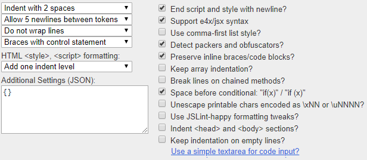

# Formatting


## Plugin Beautify


### js-beautify for VS Code

https://marketplace.visualstudio.com/items?itemName=HookyQR.beautify

## Format Generator

### beautifier

https://beautifier.io/

My current settings



.jsbeautifyrc file:

``` json
{
  "indent_size": "2",
  "indent_char": " ",
  "max_preserve_newlines": "5",
  "preserve_newlines": true,
  "keep_array_indentation": false,
  "break_chained_methods": false,
  "indent_scripts": "normal",
  "brace_style": "collapse,preserve-inline",
  "space_before_conditional": true,
  "unescape_strings": false,
  "jslint_happy": false,
  "end_with_newline": true,
  "wrap_line_length": "0",
  "indent_inner_html": false,
  "comma_first": false,
  "e4x": true,
  "indent_empty_lines": false
}
```